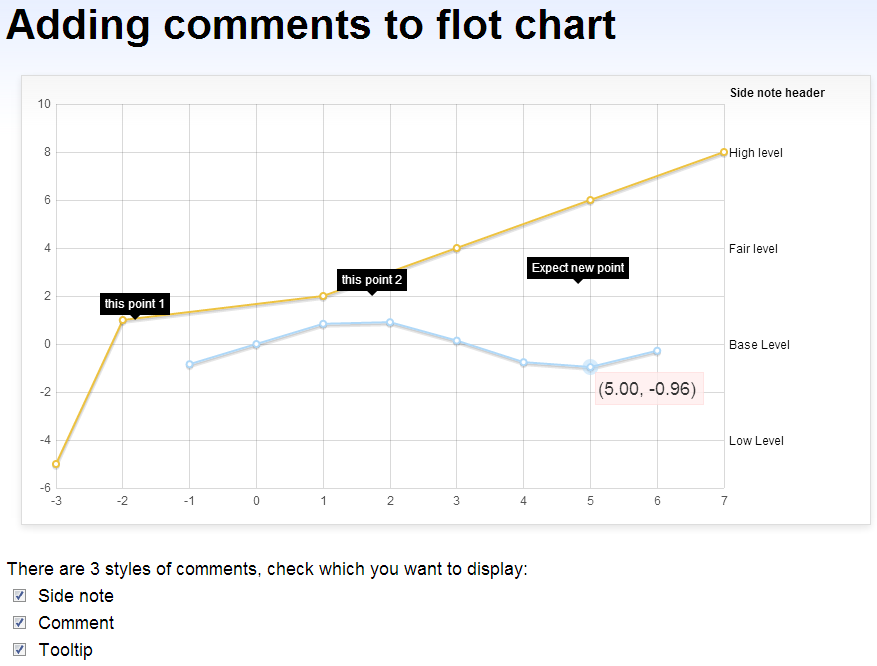

jquery.flot.comments.js
=======================

Flot plugin that shows extra comments to the flot chart. There are several types of comments:
 - **tooltip**: Show the data point value (x, y) when mouse over a data point;
 - **comment**: A callout style textbox that always shows at the specified position;
 - **sidenote**: Texts that shows at the right side of the chart that only associated with the
 y-axis coordinate.

**Usage:**

Inside the `<head></head>` area of your html page, add the following lines:
    
```html
<script type="text/javascript" src="http://zizhujy.com/Scripts/flot/jquery.flot.comment.js"></script>
```

pass your comments, sidenotes to the options object when you draw the flot chart by $.plot():

```javascript
var options = {
	comment: {
		show: true
	},
	comments: [
		{
			x: -2,
			y: 1,
			contents: "this point 1"
		},
		...
	],
	sidenote: {
		show: true
	},
	sidenotes: [
		{
			y: -4,
			contents: "Low Level",
			offsetX: 0,
			offsetY: 0,
			maxWidth: 0.15
		},
		...
	]
};

$.plot("#canvas-wrapper", data, options);
```

**Online examples:**

- [Comment Example](examples/CommentExample.html "Comment Example")

**Dependencies:**

- jquery.js
- jquery.colorhelpers.js
- jquery.flot.js

**Customizations:**

```javascript
options{
    comment: {
        "class": "jquery-flot-comment",
        wrapperCss: {
            "position": "absolute",
            "display": "block",
            "margin": "0",
            "line-height": "1em",
            "background-color": "transparent",
            "color": "white",
            "padding": "0",
            "font-size": "xx-small",
            "box-sizing": "border-box",
            "text-align": "center"
        },
        notch: {
            size: "5px"
        },
        htmlTemplate: function() {
            return "<div class='{1}'><div class='callout' style='position: relative; margin: 0; padding: 0; background-color: #000; width: 1%\0 /* IE 8 width hack */; box-sizing: border-box; padding: 5px;'><div style='line-height: 1em; position: relative;'>{{0}}</div><b class='notch' style='position: absolute; bottom: -{0}; left: 50%; margin: 0 0 0 -{0}; border-top: {0} solid #000; border-left: {0} solid transparent; border-right: {0} solid transparent; border-bottom: 0; padding: 0; width: 0; height: 0; font-size: 0; line-height: 0; _border-right-color: pink; _border-left-color: pink; _filter: chroma(color=pink);'></b></div></div>".format(this.notch.size, this.class);
        },
        show: true,
        position: {
            offsetX: 0,
            offsetY: 0,
            x: function (x) {
                return {
                    "left": x + parseFloat(this.offsetX || 0)
                };
            },
            y: function (y) {
                return {
                    "top": y + parseFloat(this.offsetY || 0)
                };
            }
        }
    },
    sidenote: {
        "class": "jquery-flot-sidenote",
        wrapperCss: {
            "position": "absolute",
            "display": "block",
            "line-height": "1.1em",
            "margin": "0",
            "font-size": "smaller"
        },
        maxWidth: 0.2, /* Width percentage of the whole chart width */
        show: true,
        position: {
            offsetX: "5px",
            offsetY: 0,
            x: function(x) {
                return {
                    "left": x + parseFloat(this.offsetX || 0)
                };
            },
            y: function(y) {
                return {
                    "top": y + parseFloat(this.offsetY || 0)
                };
            }
        }
    }
}
```

**Online demos:**

- [Online plotter (tooltip)](http://zizhujy.com/plotter "Online plotter")
- [Online Function Grapher (tooltip)](http://zizhujy.com/functiongrapher "Online Function Grapher")

**Screenshots:**

